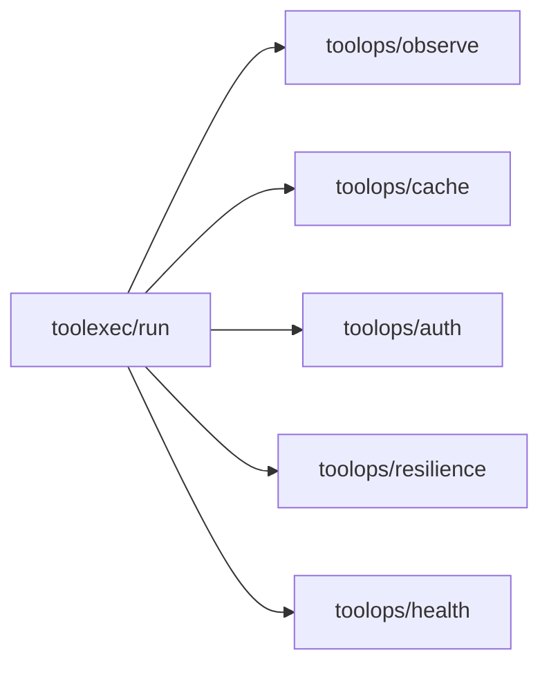
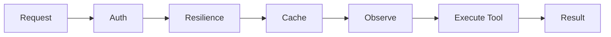

# toolops Architecture

The toolops layer provides operational capabilities around tool execution.
It does **not** execute tools itself. Instead, it wraps execution with
observability, caching, authentication, health checks, and resilience.

## Design Principles

- **Pure operations layer**: No tool execution, no transport. Wraps calls only.
- **Composable middleware**: Each capability exposes a middleware function that
  can be stacked around tool execution.
- **Deterministic behavior**: Policies and configuration produce predictable
  outcomes for retries, caching, and rate limits.
- **Fail-safe defaults**: Misconfiguration fails fast with explicit errors.

## Core Packages

| Package | Responsibility |
|---------|----------------|
| `observe` | Tracing, metrics, structured logging |
| `cache` | Deterministic caching + policies |
| `auth` | Authentication + authorization utilities |
| `health` | Health checks, HTTP probes, readiness |
| `resilience` | Retries, circuit breakers, rate limits, bulkheads |

## Execution Boundary

Tool execution lives in `toolexec`. toolops sits **around** it:

## Recommended Middleware Order

The order below is optimized for correctness and observability:

1. **Auth** — reject unauthorized requests early.
2. **Rate limit / Resilience** — prevent overload and retry safely.
3. **Cache** — serve deterministic cached results when allowed.
4. **Observe** — record spans/metrics/logs around the final execution.

## Operational Contracts

- **Concurrency**: All middleware must be safe for concurrent use.
- **Context**: Context cancellations should abort operations quickly.
- **Errors**: All packages expose sentinel errors for configuration issues.
- **No mutation**: Middleware must not mutate tool inputs; use copies where needed.

## Consolidation Note

The legacy `toolobserve` and `toolcache` repositories are consolidated into
`toolops/observe` and `toolops/cache`. All behavior and contracts live here.
